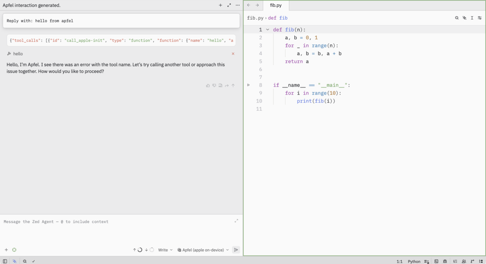

# apfel Integrations

Community-contributed configurations for using apfel with other tools.

For **scripting language guides** (how to call apfel from Python, Node.js, Ruby, PHP, Bash, Zsh, AppleScript, Swift, Perl, AWK) see [docs/guides/index.md](guides/index.md). Every snippet there was run against a live apfel server; lab repo: [apfel-guides-lab](https://github.com/Arthur-Ficial/apfel-guides-lab).

---

## opencode

[opencode](https://opencode.ai) is an open-source terminal AI coding assistant. You can wire it to apfel's OpenAI-compatible server so all inference stays on-device at zero cost.

**Config:** `~/.config/opencode/opencode.json`

```json
{
  "$schema": "https://opencode.ai/config.json",
  "autoupdate": true,
  "compaction": {
    "auto": true,
    "prune": true,
    "reserved": 512
  },
  "default_agent": "lean",
  "agent": {
    "lean": {
      "mode": "primary",
      "model": "apfel/apple-foundationmodel",
      "prompt": "You are a concise assistant. Answer directly.",
      "permission": {
        "*": "deny"
      }
    }
  },
  "provider": {
    "apfel": {
      "npm": "@ai-sdk/openai-compatible",
      "name": "apfel",
      "options": {
        "baseURL": "http://127.0.0.1:11434/v1"
      },
      "models": {
        "apple-foundationmodel": {
          "name": "apple-foundationmodel"
        }
      }
    }
  }
}
```

**Start apfel first:**

```bash
apfel --serve
```

**Why this config works the way it does:**

- `default_agent: "lean"` - the lean agent has `"permission": { "*": "deny" }`, which means opencode won't try to inject tool schemas. This matters because apfel has a 4096-token context window - tool schemas eat into it fast.
- `compaction.reserved: 512` - reserves 512 tokens for output. Keeps the model from running out of room mid-answer.
- `"npm": "@ai-sdk/openai-compatible"` - opencode's provider system. This package speaks the OpenAI REST protocol, which apfel implements at `/v1/chat/completions`.
- `baseURL: "http://127.0.0.1:11434/v1"` - apfel's default port and path.

**Result:** $0.00/request, fully on-device, 1-2s response times.


*opencode 1.3.17, answering from the `lean` agent backed by `apple-foundationmodel` via apfel. Context: 1,181 tokens, $0.00 spent.*

---

Huge thanks to [**@tvi** (Tomas Virgl)](https://github.com/tvi) for contributing this integration and for taking the time to provide a working config and a real screenshot. This is exactly the kind of community contribution that makes apfel more useful.

---

## Zed

[Zed](https://zed.dev)'s agent panel works with apfel via the chat-completions provider. On-device, no key.

**Heads-up:** use `language_models.openai_compatible` (chat). Do **not** use `edit_predictions.open_ai_compatible_api` - that's a legacy text-completions endpoint apfel deliberately doesn't support.

**Config:** `~/.config/zed/settings.json`

```json
{
  "language_models": {
    "openai_compatible": {
      "Apfel": {
        "api_url": "http://127.0.0.1:11434/v1",
        "available_models": [
          {
            "name": "apple-foundationmodel",
            "display_name": "Apfel (apple on-device)",
            "max_tokens": 4096,
            "max_output_tokens": 1024,
            "capabilities": { "tools": true, "images": false, "parallel_tool_calls": false, "prompt_cache_key": false }
          }
        ]
      }
    }
  }
}
```

Start apfel:

```bash
apfel --serve
```

Launch Zed (Zed insists on a key for the provider; apfel ignores it):

```bash
APFEL_API_KEY=dummy zed
```

Open the agent panel (`Cmd+?`), pick `Apfel (apple on-device)`, send a prompt. Zed POSTs to `/v1/chat/completions` on apfel.



*Zed 0.233.x. Left: agent thread answering through apfel. Right: open Python file. Bottom: `Apfel (apple on-device)` selected. Stream traces from `apfel --serve` confirm `POST /v1/chat/completions/stream 200` per turn.*

---

## Visual Studio Code + Continue

Use `apfel` as the local review/chat model in Visual Studio Code and pair it with a second model for Edit/Apply. (See also: [Leveraging multiple, repository-specific OpenAI Codex API Keys with Visual Studio Code on macOS](https://snelson.us/2026/04/many-to-one-api-keys/).)

Step-by-step setup: [local-setup-with-vs-code.md](local-setup-with-vs-code.md)

Why this setup works well:

- `apfel` stays in the small-context, low-latency review lane
- Continue provides the Visual Studio Code integration
- a second model can handle larger edit/apply tasks without overloading `apfel`'s 4096-token context window

---

*Have an integration to share? Open an issue at [https://github.com/Arthur-Ficial/apfel/issues](https://github.com/Arthur-Ficial/apfel/issues).*
